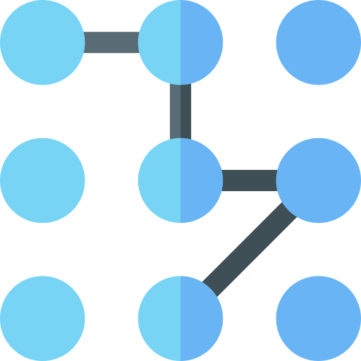
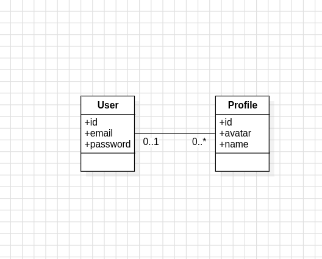

<h1>
    
    DESIGN PATTERN: BUILDER
</h1>
The Builder pattern is a creational design pattern that allows for the construction of complex objects step by step. It separates the construction of an object from its representation, enabling the same construction process to create different representations. This pattern is useful when an object may have different configurations or when there are many optional parameters in the construction process.

<h2>
    
    About project
</h2>

<p>By utilizing the Builder pattern, we can construct instances of User and Profile objects step by step, allowing for flexible configuration options and ensuring that the construction process is separated from the representation of the objects. This approach improves code readability, maintainability, and scalability, especially in scenarios where objects may have different configurations or optional parameters.
</p>

<h2>
    
    Class diagram
</h2>

<p align="center">
 
</p>

# Project structure

```
- 📁 src
  - 📁 main
    - 📁 java
      - 📁 com
        - 📁 example
          - 📁 models
            - 📄 Profile.java
            - 📄 User.java
        - 📁 resources
  - 📁 test
    - 📁 java
      - 📁 com/example/models
          - 📄 ProfileTest.java
          - 📄 UserTest.java


```
